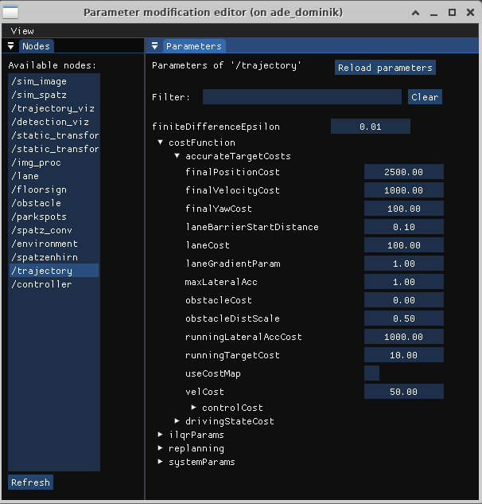

# rig-reconfigure

Attempt of a RQT-reconfigure alternative based on [Dear ImGui](https://github.com/ocornut/imgui). Many thanks 
to [ocornut](https://github.com/ocornut) for developing imgui, without, this project would not have been possible!

## Why?

During the development of our autonomous racing car we struggled to become friends with the dynamic reconfigure
plugin of RQT. One of the main features missing for us was the ability to group parameters according to their prefix.
Apparently, a [request](https://github.com/ros-visualization/rqt_reconfigure/issues/69) for this feature has already been 
opened in the official rqt-reconfigure repository a while ago, but is still open.

We considered implementing the required features within the RQT environment, but due to a lack of experience with
Qt-GUIs we switched our focus to a standalone application (hoping that this would be easier).
Nevertheless, we would appreciate it if the features find their way back into the RQT environment.
However, at least at the moment we are satisfied with the standalone application and hence won't push further into this direction.

## Features:  

 - allows only the selection of a single node (in our use-case selecting multiple nodes was not necessary and lead only to confusion)
 - parameters are grouped based on their prefix (separation by `/`)
 - the parameter tree can be filtered

The editor can be launched using `ros2 run rig_reconfigure rig_reconfigure`.

## TODO List

The following features are not implemented yet, but would be nice to have. PRs are welcome!

- feedback about the success of modifying parameters 
  (intended: directly behind the parameters, e.g. using spinners / checkmarks)
- support for array parameters
- consideration of limits specified in the [parameter description](https://docs.ros2.org/galactic/api/rcl_interfaces/msg/ParameterDescriptor.html)

## Known issues

- CPU usage is high when using non-hardware-accelerated OpenGL implementation, which is usually the case in VNC connections
- vsync via glfw doesn't work in VNC sessions (leading to even higher CPU usage), enable the manual frame rate limiting to reduce it

## Screenshots

